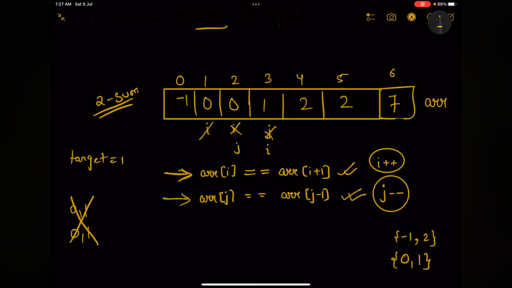
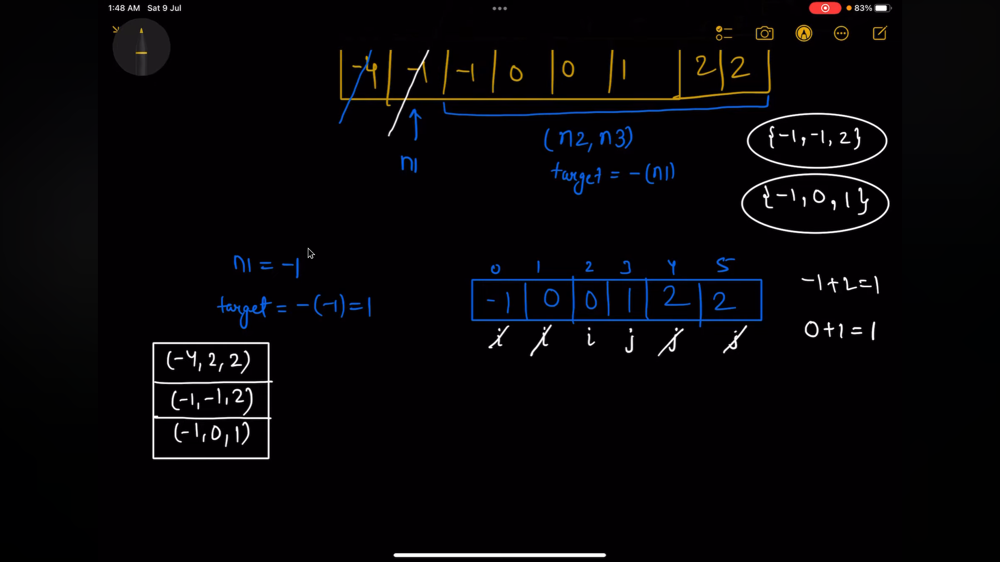

# Converging (Sorted array and target sum)
## LC
1. 11 container with most water
2. 2Sum (Prerequisite)
3. 15, 16, etc


### LC-1 2SUM
Given an array of integers nums and an integer target, return indices of the two numbers such that they add up to target.

You may assume that each input would have exactly one solution, and you may not use the same element twice.

You can return the answer in any order.

 

Example 1:

Input: nums = [2,7,11,15], target = 9
Output: [0,1]
Explanation: Because nums[0] + nums[1] == 9, we return [0, 1].
Example 2:

Input: nums = [3,2,4], target = 6
Output: [1,2]
Example 3:

Input: nums = [3,3], target = 6
Output: [0,1]
 
###  Brute force solution:
    nums = [2,7,11,15]
   
        we can take two for loops,

            for(i=0; i<nums.lenght-1; i++)
                for(j=i+1; j<nums.length; j++)
        TC - O (N^2)
        SC - O (1)

### Optimal approach 
    we know, current[i] + number_needed = target,
    so ie, 
    
    number_needed = target - current[i]

    we will use a hash for this.
    1. create the map, store numberToIndex
     nums = [2,7,11,15]

    map = {
        2:0,
        7:1,
        11:2,
        15:3,
    }

## Code
``` JS
    var twoSum = function(nums, target) {

    const numberToIndex = {};

    for (let i=0; i<nums.length; i++) {
        numberToIndex[nums[i]] = i; 
    }

    for (let i=0; i<nums.length; i++) {
        const numberNeeded = target - nums[i];
        if (numberToIndex[numberNeeded] !== undefined && numberToIndex[numberNeeded] !== i) {
            return [i, numberToIndex[numberNeeded]]
        }

    }
};
```


# LC 15 3SUM
Given an integer array nums, return all the triplets [nums[i], nums[j], nums[k]] such that i != j, i != k, and j != k, and nums[i] + nums[j] + nums[k] == 0.

Notice that the solution set must not contain duplicate triplets.




1. Sorting
2. check duplicates
3. fixed n1 -> duplicates 

## Code 

``` js
var twoSum = function(nums, target, i, j, result) {
    while (i<j) {
        if (nums[i] + nums[j] > target) 
            j--;
        else if (nums[i] + nums[j] < target)
            i++;
        else {
            // first move duplicate from either end
            while (i<j && nums[i] === nums[i+1]) i++;
            while (i<j && nums[j] === nums[j-1]) j--;

            result.push([-target, nums[i], nums[j]])
            i++;
            j--;
        }
    }
}

var threeSum = function(nums) {
    let result = [];
    const n = nums.length;
    // base case 
    if (n<3)
        return [];
    
    // firstly sort 
    nums.sort((a,b) => a-b);
    // fix one element n1
    for (let i=0; i<n; i++) {
        if (i>0 && nums[i] === nums[i-1]) // checks for fixed n1 duplicate
            continue;
        let n1 = nums[i];
        let target = -n1;
        twoSum(nums, target, i+1, n-1, result); // it will find n2 and n3 : [n1,n2,n3]
    }
    return result;
};
```


